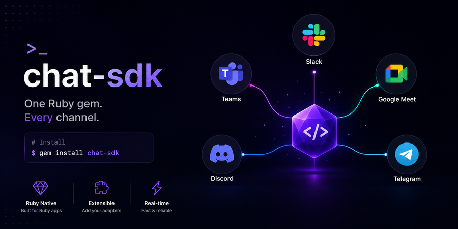

<p align="center">
  
</p>

<p align="center">
  <a href="https://github.com/rootlyhq/chat-sdk/actions/workflows/ci.yml"></a>
  <a href="LICENSE"></a>
  <a href="https://rubygems.org/gems/chat_sdk"></a>
</p>

> **Beta** — This SDK is experimental and under active development. APIs may change between minor versions. Not recommended for production use yet.

Unified Ruby SDK for building chat bots across Slack, Microsoft Teams, Google Chat, Mattermost, Discord, Telegram, and more. **Write your bot logic once, deploy everywhere.**

Inspired by and built upon the API design of [Vercel's Chat SDK](https://chat-sdk.dev) (TypeScript). This is an independent Ruby implementation — not a fork — with idiomatic Ruby patterns, a block-based cards DSL, and adapters tailored for the Ruby ecosystem.

## Installation

Add the core gem and one or more adapters to your Gemfile:

```ruby
gem "chat_sdk"
gem "chat_sdk-slack"
gem "chat_sdk-teams"
gem "chat_sdk-gchat"
gem "chat_sdk-mattermost"
gem "chat_sdk-discord"
gem "chat_sdk-telegram"
gem "chat_sdk-state-redis"
```

## Usage

```ruby
require "chat_sdk"
require "chat_sdk/slack"
require "chat_sdk/state/redis"

bot = ChatSDK::Chat.new(
  user_name: "mybot",
  adapters: {
    slack: ChatSDK::Slack::Adapter.new(
      bot_token: ENV["SLACK_BOT_TOKEN"],
      signing_secret: ENV["SLACK_SIGNING_SECRET"]
    )
  },
  state: ChatSDK::State::Redis.new(url: ENV["REDIS_URL"])
)

bot.on_new_mention do |thread, message|
  thread.subscribe
  thread.post("Hello! I'm listening to this thread.")
end

bot.on_subscribed_message do |thread, message|
  thread.post("You said: #{message.text}")
end
```

Mount webhooks in Rails:

```ruby
# config/routes.rb
mount Bot.webhooks[:slack], at: "/webhooks/slack"
```

Or plain Rack:

```ruby
# config.ru
map("/webhooks/slack") { run Bot.webhooks[:slack] }
```

See the [Getting Started guide](docs/getting-started.md) for a full walkthrough.

## Features

- [**Event handlers**](docs/handling-events.md) — mentions, messages, reactions, button clicks, slash commands
- [**Streaming**](docs/streaming.md) — stream LLM responses with progressive message editing and throttled updates
- [**Cards DSL**](docs/cards.md) — Ruby block-based interactive cards (Block Kit, Adaptive Cards, Google Chat Cards)
- [**Actions**](docs/actions.md) — handle button clicks and dropdown selections
- [**Modals**](docs/modals.md) — form dialogs with text inputs, dropdowns, and validation
- [**Slash commands**](docs/slash-commands.md) — handle `/command` invocations
- [**Emoji & reactions**](docs/emoji.md) — cross-platform emoji reactions
- [**Direct messages**](docs/direct-messages.md) — initiate DMs programmatically
- [**Ephemeral messages**](docs/ephemeral-messages.md) — user-only visible messages
- [**Concurrency**](docs/concurrency.md) — distributed locking with configurable conflict policies (drop, force, callable)

## Cards DSL

Replace JSX with Ruby blocks:

```ruby
thread.post(ChatSDK.card(title: "Incident #4821", subtitle: "SEV1 — API latency") do
  text "Triggered by *Datadog* at 14:02 UTC"
  fields do
    field "Service", "ingest-api"
    field "On-call", "@quentin"
  end
  divider
  actions do
    button "Acknowledge", id: "incident:ack", style: :primary, value: "4821"
    button "Resolve", id: "incident:resolve", style: :danger, value: "4821"
    link_button "Runbook", url: "https://rootly.com/runbooks/api-latency"
    select id: "severity", placeholder: "Severity" do
      option "SEV1", value: "sev1"
      option "SEV2", value: "sev2"
    end
  end
end)
```

Cards render natively on each platform — Slack Block Kit, Teams Adaptive Cards, Google Chat Card V2.

## Escape Hatches

Three tiers of access — use the normalized API or drop down when you need platform-specific control:

```ruby
# Tier 1 — normalized (cross-platform)
thread.post("hello")

# Tier 2 — adapter contract (still normalized message format)
bot.adapter(:slack).post_message(channel_id: "C123", message: msg)

# Tier 3 — raw platform client
bot.adapter(:slack).client.chat_postMessage(channel: "#ops", text: "raw")
```

## Adapters

| Feature | Slack | Teams | GChat | Mattermost | Discord | Telegram |
|---------|:-----:|:-----:|:-----:|:----------:|:-------:|:--------:|
| Post/Edit/Delete | ✓ | ✓ | ✓ | ✓ | ✓ | ✓ |
| Ephemeral | ✓ | ✗ | ✓ | ✓ | ✗ | ✗ |
| Reactions | ✓ | ✓ | ✓ | ✓ | ✓ | ✓ |
| File uploads | ✓ | ✓ | ✗ | ✓ | ✓ | ✓ |
| Modals | ✓ | ✗ | ✗ | ✗ | ✗ | ✗ |
| Streaming | ✓ | ✓ | ✓ | ✓ | ✓ | ✓ |
| DMs | ✓ | ✓ | ✓ | ✓ | ✓ | ✓ |
| History | ✓ | ✓ | ✓ | ✓ | ✓ | ✗ |
| Typing | ✓ | ✗ | ✗ | ✓ | ✗ | ✓ |

Platform clients:
- **Slack** — wraps [slack-ruby-client](https://github.com/slack-ruby/slack-ruby-client)
- **Teams** — raw Faraday client (no Ruby Bot Framework SDK exists)
- **GChat** — wraps [google-apps-chat-v1](https://github.com/googleapis/google-cloud-ruby)
- **Mattermost** — raw Faraday client wrapping the Mattermost REST API
- **Discord** — raw Faraday client wrapping the Discord REST API v10 with Ed25519 signature verification
- **Telegram** — raw Faraday client wrapping the Telegram Bot API with webhook secret token verification and inline keyboard rendering

## AI Coding Agents

For agent-readable documentation, see [llms.txt](llms.txt) (page index).

## Documentation

Full documentation is available in the [docs/](docs/) directory.

- [Getting Started](docs/getting-started.md)
- [Platform Adapters](docs/platform-adapters.md)
- [State Adapters](docs/state-adapters.md)
- [Rails Integration](docs/rails.md)
- [Testing](docs/testing.md)
- [Building Adapters](docs/contributing/building-adapters.md)

## Contributing

See [CONTRIBUTING.md](.github/CONTRIBUTING.md) for guidance. For security vulnerabilities, see [SECURITY.md](.github/SECURITY.md).

## Acknowledgments

Thanks to the [Vercel](https://vercel.com) team for creating the original [Chat SDK](https://github.com/vercel/chat) (MIT). Their elegant API design — normalized events, pluggable adapters, cards abstraction, and streaming model — is what made this Ruby port possible. We're grateful for their work and the open source community around it.

## License

MIT — see [LICENSE](LICENSE).

Made by [Rootly](https://rootly.com)
